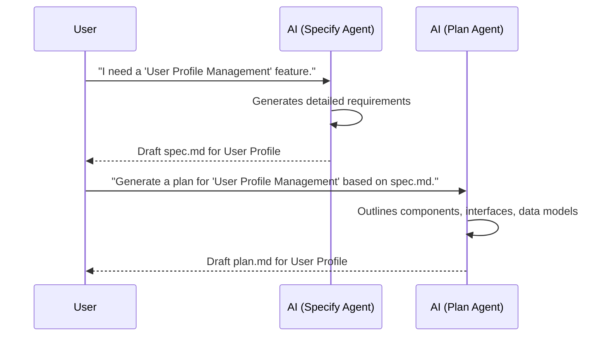

# Introduction to AI-Spec-Driven Book

## The Dawn of a New Computing Era

Welcome to the cutting-edge world of AI-Spec-Driven Development, a paradigm shift in how we conceive, design, and implement software. This book serves as your comprehensive guide to mastering this transformative approach, enabling you to build robust, intelligent systems with unprecedented precision and efficiency. We will embark on a journey that covers foundational concepts, practical methodologies, and advanced techniques, equipping you with the skills to leverage AI in crafting specifications, generating plans, and ultimately, accelerating your development lifecycle. Prepare to redefine your understanding of software engineering and unlock the full potential of AI-assisted development.

<p align="center">
  
</p>

## Learning Objectives

By the end of this chapter, you will be able to:

*   Understand the core principles and benefits of AI-Spec-Driven Development.
*   Differentiate between traditional software development and AI-enhanced approaches.
*   Identify key components and tools used in an AI-Spec-Driven workflow.
*   Grasp the fundamental concepts of specification generation and task planning with AI.
*   Set up a basic environment for exploring AI-Spec-Driven Development.

## 1.1 What is AI-Spec-Driven Development?

AI-Spec-Driven Development (AI-SDD) is an innovative methodology that integrates artificial intelligence throughout the software development lifecycle, primarily focusing on automating and enhancing the creation of specifications, architectural plans, and actionable tasks. Unlike traditional methods where these artifacts are primarily human-generated, AI-SDD leverages large language models (LLMs) and specialized AI agents to generate, refine, and validate development artifacts. This approach aims to reduce manual effort, minimize ambiguities, improve consistency across documentation, and ultimately accelerate time-to-market. The motivation behind AI-SDD stems from the increasing complexity of modern software systems and the need for more efficient, error-resistant development processes. By allowing AI to assist in the early stages of design and planning, teams can focus more on creative problem-solving and less on repetitive documentation, leading to higher quality software delivered faster.

### 1.1.1 Brief history and motivation

The evolution of AI-SDD can be traced from earlier concepts like Model-Driven Development (MDD) and Behavior-Driven Development (BDD), which emphasized automation and clear, executable specifications. With the advent of powerful generative AI models, particularly large language models (LLMs), the ability to process and generate human-like text has opened new avenues for automating specification creation. The primary motivation is to overcome the limitations of manual processes, such as human error, inconsistencies across documents, and the significant time investment required for detailed planning. AI-SDD seeks to create a more dynamic and responsive development ecosystem where changes in requirements can quickly propagate through updated specifications, plans, and tasks, all guided and assisted by AI.

### 1.1.2 The AI-SDD Workflow

The typical AI-SDD workflow involves several key stages, each empowered by AI. It begins with high-level natural language requirements provided by a human. AI agents then assist in refining these into formal specifications (`spec.md`). From these specifications, AI generates detailed architectural plans (`plan.md`), outlining components, interfaces, and non-functional requirements. Subsequently, AI further breaks down these plans into concrete, dependency-ordered, and testable tasks (`tasks.md`). The implementation phase often involves AI in code generation, refactoring suggestions, and test case creation. Finally, AI assists in analysis, validation, and documentation. This iterative process ensures traceability from initial requirements to final code, with AI acting as an intelligent assistant at every step.


## Learning by Example: Setting up Your First AI-SDD Project

To kickstart your journey, let's set up a minimal AI-SDD project. This example will guide you through initializing a project structure and generating a simple specification using an AI agent.

```bash
# Clone the AI-Spec-Driven-Book repository (if not already cloned)
git clone https://github.com/your-repo/AI-Spec-Driven-Book.git
cd AI-Spec-Driven-Book

# Initialize a new feature spec (assuming a tool like /sp.specify exists)
# This command will prompt for a feature name and description
/sp.specify "My First Feature" "A simple feature to demonstrate AI-SDD"

# Review the generated specification
cat specs/my-first-feature/spec.md
```

## Quiz: Test Your Understanding

1.  Which of the following is **not** a primary benefit of AI-Spec-Driven Development?
    a) Reduced manual effort in documentation.
    b) Increased ambiguity in specifications.
    c) Improved consistency across development artifacts.
    d) Accelerated time-to-market.

2.  In the AI-SDD workflow, what typically follows the creation of `spec.md`?
    a) Direct code implementation.
    b) Generation of `plan.md`.
    c) User acceptance testing.
    d) Refactoring of existing code.

3.  What does the `tasks.md` file primarily contain in an AI-SDD project?
    a) High-level user stories.
    b) Detailed architectural diagrams.
    c) Actionable, dependency-ordered, and testable tasks.
    d) Project budget and timeline.

## Try It Yourself: Simulation

Imagine you need to add a "User Profile Management" feature to an application. Use your understanding of AI-SDD to outline the steps you would take, from initial requirements to a draft plan. Consider what kind of information would go into `spec.md` and `plan.md`.



---

<div className="flex-container">
  <button className="button button--primary button--lg">Personalize for Me</button>
  <button className="button button--secondary button--lg">اردو میں ترجمہ کریں</button>
</div>