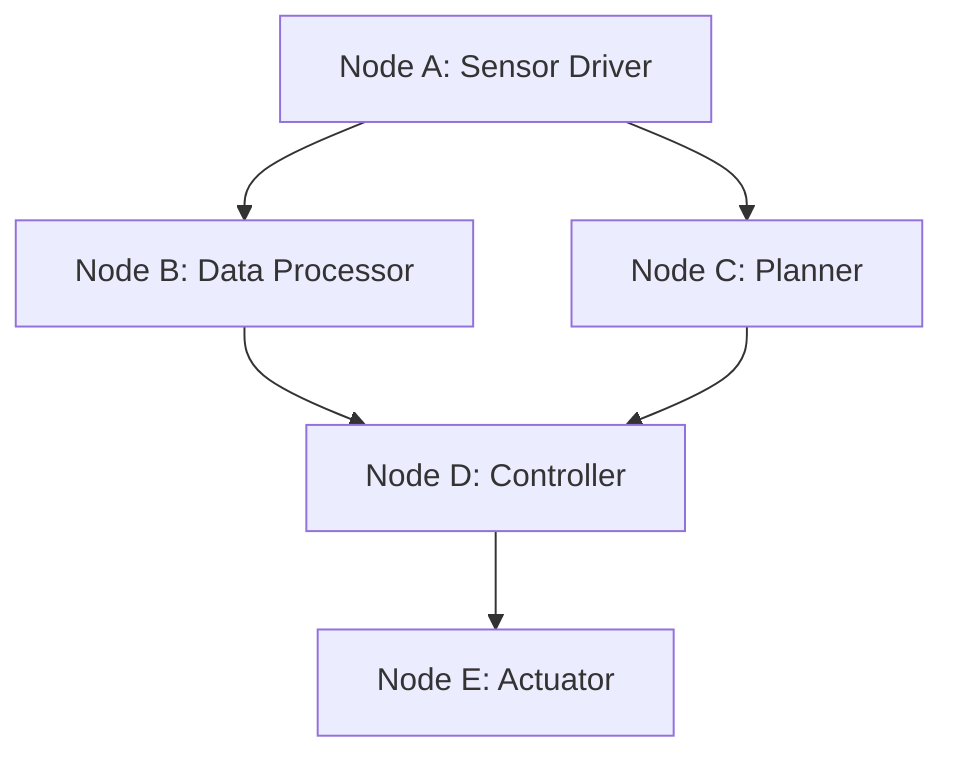
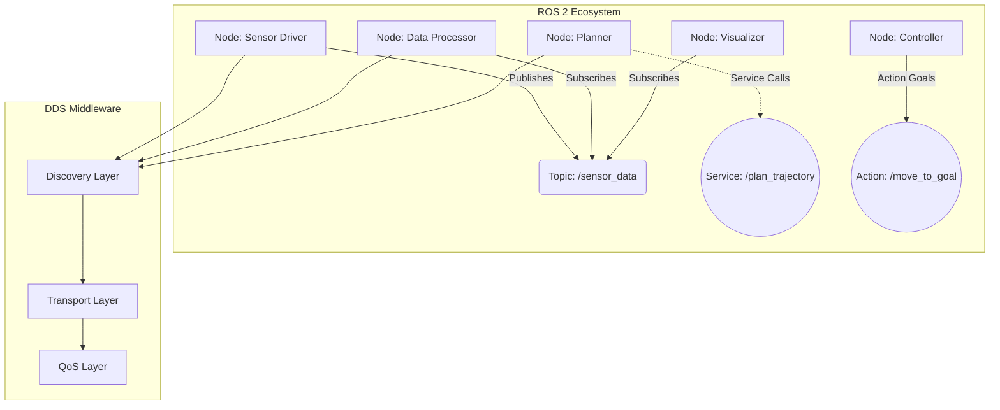

import { PersonalizeButton, UrduTranslationButton } from '@site/src/components/PersonalizationButtons';

<PersonalizeButton />
<UrduTranslationButton />

# Module 1: The Robotic Nervous System (ROS 2)

## Learning Objectives

By the end of this module, you will be able to:

- Understand the fundamental concepts of ROS 2 and its role in robotics
- Identify and explain the core communication patterns: Nodes, Topics, Services, and Actions
- Implement basic ROS 2 nodes using Python
- Design simple robotic systems using ROS 2 communication mechanisms
- Create and run simulations to test ROS 2 concepts
- Apply personalization to adapt the content to your skill level

## Introduction to ROS 2

Robot Operating System 2 (ROS 2) represents the next generation of robotics middleware, providing a comprehensive framework for developing complex robotic applications. Unlike a traditional operating system, ROS 2 is a collection of libraries, tools, and conventions that facilitate the creation of robotic software components and their interactions. Often described as the "nervous system" of robots, ROS 2 enables different software components to communicate seamlessly, allowing for distributed and modular robotic architectures that are both flexible and scalable.

## Core Concepts: Nodes, Topics, Services, and Actions

### Nodes

Nodes are the fundamental building blocks of ROS 2 applications. A node is an executable process that performs a specific task within the robotic system. Nodes can range from simple sensor drivers that publish raw data to sophisticated planning algorithms that coordinate complex behaviors. Each node operates independently and communicates with other nodes through various communication mechanisms. The modular nature of nodes allows for robust system design where individual components can be developed, tested, and maintained separately.



### Topics and Publishers/Subscribers

Topics facilitate asynchronous, one-way communication between nodes using a publish-subscribe pattern. A publisher node sends data to a topic, while subscriber nodes receive that data. This decoupling allows for flexible system design where publishers and subscribers don't need to know about each other's existence, enabling multiple subscribers to receive the same data stream. Topics are ideal for continuous data streams such as sensor readings, robot states, or camera images.

### Services

Services provide synchronous, request-response communication between nodes. A client node sends a request to a service, and the server node processes the request and returns a response. This pattern is suitable for tasks that require immediate responses or acknowledgments, such as setting parameters, triggering actions, or performing computations that need completion before continuing.

### Actions

Actions combine features of topics and services to handle long-running tasks with feedback. An action client sends a goal to an action server, which executes the task and provides continuous feedback during execution. The client can also cancel the goal or check the status. Actions are ideal for tasks like navigation, manipulation, or any operation that takes significant time to complete.

## Python Code Examples

### Simple Publisher Node

```python
import rclpy
from rclpy.node import Node
from std_msgs.msg import String

class MinimalPublisher(Node):

    def __init__(self):
        super().__init__('minimal_publisher')
        self.publisher_ = self.create_publisher(String, 'topic', 10)
        timer_period = 0.5  # seconds
        self.timer = self.create_timer(timer_period, self.timer_callback)
        self.i = 0

    def timer_callback(self):
        msg = String()
        msg.data = 'Hello World: %d' % self.i
        self.publisher_.publish(msg)
        self.get_logger().info('Publishing: "%s"' % msg.data)
        self.i += 1

def main(args=None):
    rclpy.init(args=args)
    minimal_publisher = MinimalPublisher()
    rclpy.spin(minimal_publisher)
    minimal_publisher.destroy_node()
    rclpy.shutdown()

if __name__ == '__main__':
    main()
```

### Simple Subscriber Node

```python
import rclpy
from rclpy.node import Node
from std_msgs.msg import String

class MinimalSubscriber(Node):

    def __init__(self):
        super().__init__('minimal_subscriber')
        self.subscription = self.create_subscription(
            String,
            'topic',
            self.listener_callback,
            10)
        self.subscription  # prevent unused variable warning

    def listener_callback(self, msg):
        self.get_logger().info('I heard: "%s"' % msg.data)

def main(args=None):
    rclpy.init(args=args)
    minimal_subscriber = MinimalSubscriber()
    rclpy.spin(minimal_subscriber)
    minimal_subscriber.destroy_node()
    rclpy.shutdown()

if __name__ == '__main__':
    main()
```

### Service Server Example

```python
from example_interfaces.srv import AddTwoInts
import rclpy
from rclpy.node import Node

class MinimalService(Node):

    def __init__(self):
        super().__init__('minimal_service')
        self.srv = self.create_service(AddTwoInts, 'add_two_ints', self.add_two_ints_callback)

    def add_two_ints_callback(self, request, response):
        response.sum = request.a + request.b
        self.get_logger().info('Incoming request\na: %d b: %d' % (request.a, request.b))
        return response

def main(args=None):
    rclpy.init(args=args)
    minimal_service = MinimalService()
    rclpy.spin(minimal_service)
    rclpy.shutdown()

if __name__ == '__main__':
    main()
```

## ROS 2 Architecture Diagram



## Simulation: Hands-On Exercises

### Exercise 1: Setting Up Your First ROS 2 Workspace

1. Create a new ROS 2 workspace:
   ```bash
   mkdir -p ~/ros2_ws/src
   cd ~/ros2_ws
   colcon build
   source install/setup.bash
   ```

2. Create a package for your exercises:
   ```bash
   cd ~/ros2_ws/src
   ros2 pkg create --build-type ament_python my_robot_exercises
   ```

3. Navigate to the package directory and explore the structure.

### Exercise 2: Publisher-Subscriber Communication

1. Create the publisher and subscriber nodes using the provided code examples
2. Launch both nodes in separate terminals
3. Observe the communication pattern and message flow
4. Experiment with different Quality of Service (QoS) settings

### Exercise 3: Service-Based Communication

1. Implement the service server example
2. Create a service client to interact with your server
3. Test the request-response communication pattern
4. Observe how services differ from topics in terms of synchronization

### Exercise 4: Action-Based Long-Running Tasks

1. Create an action server for a simple navigation task
2. Implement an action client that sends navigation goals
3. Monitor feedback during execution
4. Practice canceling goals and checking execution status

## Personalization Options

<div class="personalization-container">
  <div class="personalization-buttons">
    <button class="personalization-btn" data-level="beginner">Beginner</button>
    <button class="personalization-btn" data-level="intermediate">Intermediate</button>
    <button class="personalization-btn" data-level="advanced">Advanced</button>
  </div>
</div>

<div class="content-level" data-level="beginner">
  <details>
    <summary>Additional Resources for Beginners</summary>
    <p>For those new to ROS 2, consider reviewing these foundational concepts:</p>
    <ul>
      <li>Linux command line basics</li>
      <li>Python programming fundamentals</li>
      <li>Basic understanding of robotics concepts</li>
      <li>Package management with apt/pip</li>
    </ul>
  </details>
</div>

<div class="content-level" data-level="intermediate">
  <details>
    <summary>Intermediate Challenges</summary>
    <p>Enhance your understanding with these challenges:</p>
    <ul>
      <li>Implement custom message types</li>
      <li>Configure Quality of Service policies</li>
      <li>Use parameter servers for configuration</li>
      <li>Implement lifecycle nodes</li>
    </ul>
  </details>
</div>

<div class="content-level" data-level="advanced">
  <details>
    <summary>Advanced Topics</summary>
    <p>For advanced users, explore these sophisticated concepts:</p>
    <ul>
      <li>Real-time ROS 2 configurations</li>
      <li>Custom DDS implementations</li>
      <li>Security and authentication</li>
      <li>Multi-robot systems with ROS 2</li>
    </ul>
  </details>
</div>

## Summary

ROS 2 serves as the nervous system of modern robotic systems, providing essential communication patterns that enable complex robotic behaviors. Understanding Nodes, Topics, Services, and Actions is crucial for developing robust and scalable robotic applications. Through hands-on exercises, you'll gain practical experience with these concepts and develop the skills needed to create sophisticated robotic systems.

This module has provided a foundation for understanding the core communication mechanisms in ROS 2. The next modules will build upon these concepts to explore more advanced topics in robotic systems development.
