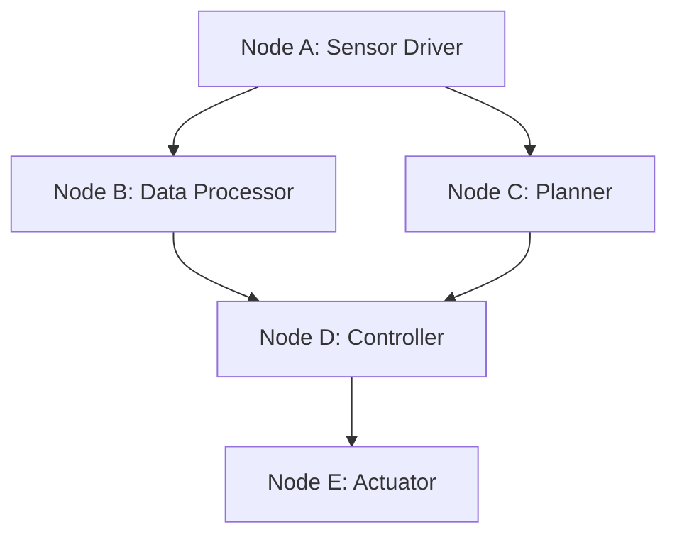
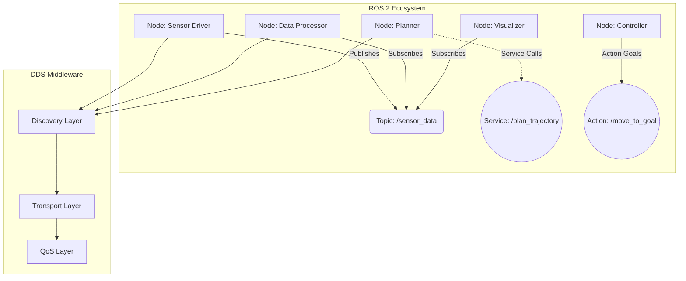

import { PersonalizeButton, UrduTranslationButton } from '@site/src/components/PersonalizationButtons';

<PersonalizeButton />
<UrduTranslationButton />

# ماڈیول 1: روبوٹکس کا اعصابی نظام (ROS 2)


## سیکھنے کے اہداف

اس ماڈیول کے اختتام تک، آپ استطاعت رکھیں گے:

- ROS 2 کے بنیادی تصورات اور اس کے روبوٹکس میں کردار کو سمجھنا
- بنیادی رابطے کے نمونے کی شناخت اور وضاحت کرنا: نوڈز، ٹاپکس، سروسز، اور ایکشنز
- Python کا استعمال کرتے ہوئے بنیادی ROS 2 نوڈز نافذ کرنا
- ROS 2 رابطے کے میکانزمز کا استعمال کرتے ہوئے سادہ روبوٹکس سسٹمز ڈیزائن کرنا
- ROS 2 کے تصورات کو جانچنے کے لیے تقلیدیں تخلیق اور چلانا
- اپنی مہارت کے لیول کے مطابق مواد کو ایڈاپٹ کرنے کے لیے ذاتی نوعیت اختیار کو نافذ کرنا

## ROS 2 کا تعارف

روبوٹ آپریٹنگ سسٹم 2 (ROS 2) روبوٹکس مڈل ویئر کی اگلی نسل کی نمائندگی کرتا ہے، جو پیچیدہ روبوٹکس ایپلی کیشنز تیار کرنے کے لیے ایک جامع فریم ورک فراہم کرتا ہے۔ روایتی آپریٹنگ سسٹم کے برعکس، ROS 2 لائبریریز، ٹولز، اور رواجوں کا ایک مجموعہ ہے جو روبوٹکس سافٹ ویئر اجزاء اور ان کے تعاملات کو تخلیق کرنے میں سہولت فراہم کرتا ہے۔ اکثر اسے روبوٹس کا "اعصابی نظام" کہا جاتا ہے، ROS 2 مختلف سافٹ ویئر اجزاء کو آپس میں رابطہ کرنے کے قابل بناتا ہے، جو تقسیم شدہ اور ماڈیولر روبوٹکس آرکیٹیکچر کی اجازت دیتا ہے جو نرم اور قابل توسیع دونوں ہیں۔

## بنیادی تصورات: نوڈز، ٹاپکس، سروسز، اور ایکشنز

### نوڈز

نوڈز ROS 2 ایپلی کیشنز کے بنیادی اجزاء ہیں۔ ایک نوڈ ایک قابل عمل عمل ہے جو روبوٹکس سسٹم کے اندر ایک مخصوص کام انجام دیتا ہے۔ نوڈز سادہ سینسر ڈرائیورز سے لے کر جنہوں نے خام ڈیٹا کو شائع کیا ہے تاکہ جامع منصوبہ بندی الگورتھم جو پیچیدہ رویے کو مربوط کرتے ہیں، تک مختلف ہوسکتے ہیں۔ ہر نوڈ آزاد طور پر کام کرتا ہے اور مختلف رابطے کے میکانزمز کے ذریعے دوسرے نوڈز کے ساتھ بات چیت کرتا ہے۔ نوڈز کی ماڈیولر نوعیت مضبوط سسٹم ڈیزائن کی اجازت دیتی ہے جہاں انفرادی اجزاء کو الگ الگ تیار، جانچ، اور برقرار رکھا جاسکتا ہے۔



### ٹاپکس اور پبلشر/سبسکرائبرز

ٹاپکس نوڈز کے درمیان غیر ہم وقتہ، ایک راستہ کا رابطہ ایک شائع کنندہ-سبسکرائبر نمونے کا استعمال کرتے ہوئے ممکن بناتے ہیں۔ ایک پبلشر نوڈ ڈیٹا کو ایک ٹاپک پر بھیجتا ہے، جبکہ سبسکرائبر نوڈز اس ڈیٹا کو وصول کرتے ہیں۔ یہ الگ الگ کرنا لچکدار سسٹم ڈیزائن کی اجازت دیتا ہے جہاں پبلشرز اور سبسکرائبرز کو ایک دوسرے کے وجود کے بارے میں جاننے کی ضرورت نہیں ہوتی، جس سے متعدد سبسکرائبرز کو ایک ہی ڈیٹا سٹریم وصول کرنے کی اجازت ملتی ہے۔ ٹاپکس جاری ڈیٹا سٹریمز کے لیے مثالی ہیں جیسے سینسر کے پڑھائی، روبوٹ کی حالت، یا کیمرہ کی تصاویر۔

### سروسز

سسٹمز نوڈز کے درمیان ہم وقتہ، درخواست-جواب رابطہ فراہم کرتی ہیں۔ ایک کلائنٹ نوڈ ایک سروس کو ایک درخواست بھیجتا ہے، اور سرور نوڈ درخواست کو پروسیس کرتا ہے اور ایک جواب لوٹاتا ہے۔ یہ نمونہ ان کاموں کے لیے مناسب ہے جنہیں فوری جوابات یا اعترافات کی ضرورت ہوتی ہے، جیسے پیرامیٹرز سیٹ کرنا، ایکشنز کو متحرک کرنا، یا ایسے کمپیوٹیشنز کو انجام دینا جنہیں جاری رکھنے سے پہلے مکمل ہونے کی ضرورت ہوتی ہے۔

### ایکشنز

ایکشنز ٹاپکس اور سروسز کی خصوصیات کو جوڑتے ہیں تاکہ ریمارکس کے ساتھ طویل مدتی کاموں کو سنبھالا جاسکے۔ ایک ایکشن کلائنٹ ایک گول کو ایک ایکشن سرور کو بھیجتا ہے، جو کام کو انجام دیتا ہے اور انجام دہی کے دوران مسلسل ریمارکس فراہم کرتا ہے۔ کلائنٹ گول کو منسوخ بھی کرسکتا ہے یا حالت کی جانچ بھی کرسکتا ہے۔ ایکشنز نیویگیشن، ہتھیلی، یا کسی بھی آپریشن کے لیے مثالی ہیں جو مکمل ہونے میں کافی وقت لیتے ہیں۔

## Python کوڈ کی مثالیں

### سادہ پبلشر نوڈ

```python
import rclpy
from rclpy.node import Node
from std_msgs.msg import String

class MinimalPublisher(Node):

    def __init__(self):
        super().__init__('minimal_publisher')
        self.publisher_ = self.create_publisher(String, 'topic', 10)
        timer_period = 0.5  # seconds
        self.timer = self.create_timer(timer_period, self.timer_callback)
        self.i = 0

    def timer_callback(self):
        msg = String()
        msg.data = 'Hello World: %d' % self.i
        self.publisher_.publish(msg)
        self.get_logger().info('Publishing: "%s"' % msg.data)
        self.i += 1

def main(args=None):
    rclpy.init(args=args)
    minimal_publisher = MinimalPublisher()
    rclpy.spin(minimal_publisher)
    minimal_publisher.destroy_node()
    rclpy.shutdown()

if __name__ == '__main__':
    main()
```

### سادہ سبسکرائبر نوڈ

```python
import rclpy
from rclpy.node import Node
from std_msgs.msg import String

class MinimalSubscriber(Node):

    def __init__(self):
        super().__init__('minimal_subscriber')
        self.subscription = self.create_subscription(
            String,
            'topic',
            self.listener_callback,
            10)
        self.subscription  # prevent unused variable warning

    def listener_callback(self, msg):
        self.get_logger().info('I heard: "%s"' % msg.data)

def main(args=None):
    rclpy.init(args=args)
    minimal_subscriber = MinimalSubscriber()
    rclpy.spin(minimal_subscriber)
    minimal_subscriber.destroy_node()
    rclpy.shutdown()

if __name__ == '__main__':
    main()
```

### سروس سرور کی مثال

```python
from example_interfaces.srv import AddTwoInts
import rclpy
from rclpy.node import Node

class MinimalService(Node):

    def __init__(self):
        super().__init__('minimal_service')
        self.srv = self.create_service(AddTwoInts, 'add_two_ints', self.add_two_ints_callback)

    def add_two_ints_callback(self, request, response):
        response.sum = request.a + request.b
        self.get_logger().info('Incoming request\na: %d b: %d' % (request.a, request.b))
        return response

def main(args=None):
    rclpy.init(args=args)
    minimal_service = MinimalService()
    rclpy.spin(minimal_service)
    rclpy.shutdown()

if __name__ == '__main__':
    main()
```

## ROS 2 آرکیٹیکچر ڈائیگرام



## تقلید: ہاتھ سے کام کی مشقیں

### مشق 1: اپنا پہلا ROS 2 ورک سپیس سیٹ کرنا

1. ایک نیا ROS 2 ورک سپیس تخلیق کریں:
   ```bash
   mkdir -p ~/ros2_ws/src
   cd ~/ros2_ws
   colcon build
   source install/setup.bash
   ```

2. اپنی مشقوں کے لیے ایک پیکیج تخلیق کریں:
   ```bash
   cd ~/ros2_ws/src
   ros2 pkg create --build-type ament_python my_robot_exercises
   ```

3. پیکیج کی ڈائرکٹری میں جائیں اور ڈھانچہ کو دیکھیں۔

### مشق 2: پبلشر-سبسکرائبر رابطہ

1. فراہم کردہ کوڈ کی مثالوں کا استعمال کرتے ہوئے پبلشر اور سبسکرائبر نوڈز تخلیق کریں
2. الگ الگ ٹرمنلز میں دونوں نوڈز لانچ کریں
3. رابطے کے نمونے اور پیغام کے بہاؤ کو دیکھیں
4. مختلف معیار کی سروس (QoS) ترتیبات کے ساتھ تجربہ کریں

### مشق 3: سروس پر مبنی رابطہ

1. سروس سرور کی مثال نافذ کریں
2. اپنے سرور کے ساتھ بات چیت کرنے کے لیے ایک سروس کلائنٹ تخلیق کریں
3. درخواست-جواب رابطے کے نمونے کو جانچیں
4. دیکھیں کہ سینکرونائزیشن کے لحاظ سے سروسز ٹاپکس سے کیسے مختلف ہیں

### مشق 4: ایکشن پر مبنی طویل مدتی کام

1. ایک سادہ نیویگیشن کام کے لیے ایک ایکشن سرور تخلیق کریں
2. نیویگیشن گولز بھیجنے والے ایکشن کلائنٹ کو نافذ کریں
3. انجام دہی کے دوران ریمارکس کو مانیٹر کریں
4. گولز کو منسوخ کرنے اور انجام دہی کی حالت کی جانچ کا مشق کریں

## ذاتی نوعیت کے اختیارات

<div class="personalization-container">
  <div class="personalization-buttons">
    <button class="personalization-btn" data-level="beginner">مبتدی</button>
    <button class="personalization-btn" data-level="intermediate">درمیانہ</button>
    <button class="personalization-btn" data-level="advanced">اعلی درجے کا</button>
  </div>
</div>

<div class="content-level" data-level="beginner">
  <details>
    <summary>مبتدیوں کے لیے اضافی وسائل</summary>
    <p>ROS 2 میں نئے لوگوں کے لیے، ان بنیادی تصورات کا جائزہ لینا غور کریں:</p>
    <ul>
      <li>لینکس کمانڈ لائن کے بنیادیات</li>
      <li>Python پروگرامنگ کے بنیادیات</li>
      <li>روبوٹکس کے تصورات کی بنیادی سمجھ</li>
      <li>apt/pip کے ساتھ پیکیج مینجمنٹ</li>
    </ul>
  </details>
</div>

<div class="content-level" data-level="intermediate">
  <details>
    <summary>درمیانہ چیلنج</summary>
    <p>اپنی سمجھ کو بہتر بنانے کے لیے ان چیلنجوں کا استعمال کریں:</p>
    <ul>
      <li>حسب ضرورت پیغام کی اقسام نافذ کریں</li>
      <li>معیار کی سروس کی پالیسیز کنفیگر کریں</li>
      <li>کنفیگریشن کے لیے پیرامیٹر سرورز کا استعمال کریں</li>
      <li>لائف سائیکل نوڈز نافذ کریں</li>
    </ul>
  </details>
</div>

<div class="content-level" data-level="advanced">
  <details>
    <summary>اعلی درجے کے موضوعات</summary>
    <p>اعلی درجے کے صارفین کے لیے، ان ترقی یافتہ تصورات کو تلاش کریں:</p>
    <ul>
      <li>حقیقی وقت ROS 2 کنفیگریشنز</li>
      <li>حسب ضرورت DDS نفاذات</li>
      <li>سیکیورٹی اور توثیق</li>
      <li>ROS 2 کے ساتھ متعدد روبوٹ سسٹمز</li>
    </ul>
  </details>
</div>

## خلاصہ

ROS 2 جدید روبوٹکس سسٹمز کا اعصابی نظام کا کام کرتا ہے، جو پیچیدہ روبوٹکس کے رویے کو ممکن بنانے والے ضروری رابطے کے نمونے فراہم کرتا ہے۔ نوڈز، ٹاپکس، سروسز، اور ایکشنز کو سمجھنا مضبوط اور قابل توسیع روبوٹکس ایپلی کیشنز تیار کرنے کے لیے اہم ہے۔ ہاتھ سے کام کی مشقوں کے ذریعے، آپ ان تصورات کے ساتھ عملی تجربہ حاصل کریں گے اور جامع روبوٹکس سسٹمز تخلیق کرنے کے لیے ضروری مہارتوں کو تیار کریں گے۔

اس ماڈیول نے ROS 2 میں بنیادی رابطے کے میکانزمز کو سمجھنے کے لیے ایک بنیاد فراہم کی ہے۔ اگلے ماڈیولز ان تصورات پر مزید تعمیر کریں گے تاکہ روبوٹکس سسٹمز کی ترقی میں مزید ترقی یافتہ موضوعات کو تلاش کیا جاسکے۔