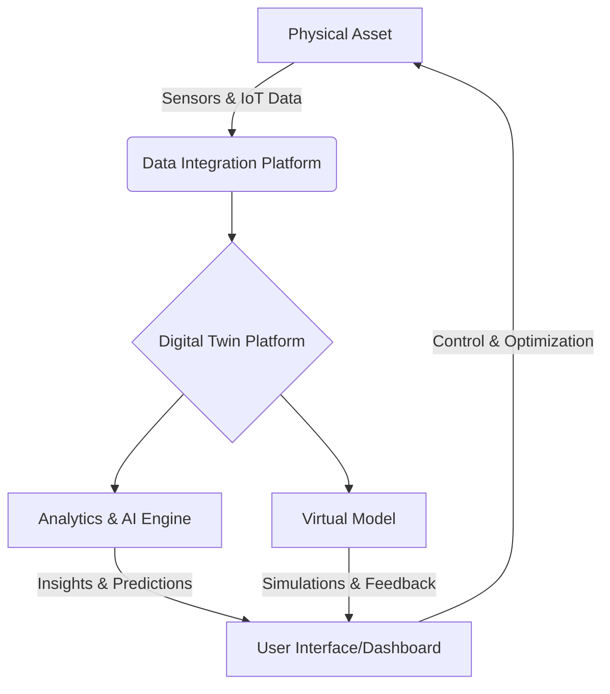

## Digital Twin Technology: Bridging the Physical and Virtual Worlds

The concept of a "digital twin" has rapidly evolved from a futuristic vision into a transformative reality, fundamentally reshaping how industries design, operate, and maintain complex systems. A digital twin is a virtual representation of a physical object, process, or system, continuously updated with real-time data to mirror its real-world counterpart. This powerful synergy between the physical and digital realms enables unprecedented levels of monitoring, analysis, and optimization. This module will delve into the core principles of digital twin technology, exploring its foundational components, diverse applications across various sectors, and the profound benefits it offers in enhancing efficiency, predicting outcomes, and driving innovation. We will also examine the challenges inherent in its implementation and cast an eye towards the exciting future trends that promise to further integrate and expand the capabilities of digital twins, from hyper-realistic simulations to its role in the metaverse.

---


## Learning Objectives

By the end of this module, you will be able to:
*   Define what a digital twin is and explain its core concepts.
*   Identify the key components of a digital twin system.
*   Differentiate between various types of digital twins.
*   Discuss the applications of digital twin technology across different industries.
*   Analyze the benefits and challenges associated with implementing digital twins.
*   Explore future trends and emerging technologies related to digital twins.

## 1.1 What is a Digital Twin?

A digital twin is a virtual replica of a physical asset, process, or system that serves as a dynamic bridge between the real and digital worlds. It is not merely a static 3D model, but a living, breathing virtual counterpart that continuously updates with real-time data from its physical twin. This constant synchronization allows for comprehensive analysis, predictive modeling, and informed decision-making without directly impacting the physical entity.

### 1.1.1 Definition and Core Concepts

At its core, a digital twin is characterized by three main elements:
1.  **Physical Product:** The real-world asset being duplicated (e.g., a wind turbine, a factory floor, a human organ).
2.  **Virtual Model:** The digital representation of the physical product, incorporating its geometry, physics, behavior, and historical data.
3.  **Connected Data:** Real-time data streams from sensors, IoT devices, and other sources that feed information from the physical product to the virtual model, enabling continuous synchronization.

This dynamic connection allows the digital twin to simulate, predict, and optimize the performance of its physical counterpart.

### 1.1.2 Historical Context and Evolution

The concept of mirroring physical objects digitally can be traced back to early NASA simulations in the 1960s, where "pairing technology" was used to manage complex space missions. However, the term "digital twin" was coined by Dr. Michael Grieves in 2002 at the University of Michigan, initially for product lifecycle management. The advent of IoT, advanced analytics, cloud computing, and AI in the 21st century has propelled digital twin technology from theoretical concept to practical, widespread application across diverse industries.

## 1.2 Components of a Digital Twin System

A fully functional digital twin system comprises several integrated components working in concert:

### 1.2.1 Physical Asset

This is the real-world object or system that the digital twin represents. It is equipped with sensors and other data-gathering mechanisms to capture its operational state, environmental conditions, and performance metrics.

### 1.2.2 Virtual Model

The virtual model is the digital representation. It includes detailed CAD models, physics-based simulations, behavioral models, and historical data. This model provides the framework for understanding the physical asset's characteristics and predicting its behavior.

### 1.2.3 Data Integration (Sensors, IoT)

Data is the lifeblood of a digital twin. Sensors embedded in the physical asset collect real-time data (temperature, pressure, vibration, etc.), which is then transmitted via IoT platforms to the virtual model. This continuous data flow ensures the virtual model remains an accurate reflection of its physical counterpart.

```python
import time
import random

class Sensor:
    def __init__(self, name, min_val, max_val):
        self.name = name
        self.min_val = min_val
        self.max_val = max_val

    def read_data(self):
        # Simulate real-time data reading
        return round(random.uniform(self.min_val, self.max_val), 2)

# Example Usage:
temperature_sensor = Sensor("Temperature", 20.0, 30.0)
pressure_sensor = Sensor("Pressure", 100.0, 120.0)

print(f"Reading {temperature_sensor.name}: {temperature_sensor.read_data()} °C")
print(f"Reading {pressure_sensor.name}: {pressure_sensor.read_data()} kPa")
```

### 1.2.4 Analytics and AI

Advanced analytics, machine learning, and artificial intelligence algorithms process the integrated data to extract insights, identify patterns, predict future behavior, and optimize performance. This intelligence transforms raw data into actionable information.



## 1.3 Types of Digital Twins

Digital twins can be categorized based on their scope and granularity:

### 1.3.1 Component Twin

A component twin is a digital representation of a single, individual part of a larger system (e.g., a pump in a machine, a single sensor).

### 1.3.2 Asset Twin

An asset twin represents a collection of components working together as a functional unit (e.g., an entire engine, a robotic arm).

### 1.3.3 System/Process Twin

This type of twin models an entire system or process, such as a manufacturing line, a power grid, or a supply chain, showing how various assets and components interact.

### 1.3.4 Micro-Twin

A micro-twin focuses on extremely detailed, microscopic aspects, such as the wear and tear on a specific surface at a molecular level, or the behavior of individual cells in a biological system.

## 1.4 Applications Across Industries

Digital twin technology is being rapidly adopted across a wide range of industries:

### 1.4.1 Manufacturing and Industry 4.0

In manufacturing, digital twins optimize production lines, predict equipment failures (predictive maintenance), and simulate new processes before physical implementation, significantly reducing downtime and costs.

### 1.4.2 Healthcare

Digital twins are emerging in healthcare for creating virtual models of human organs or even entire bodies, enabling personalized treatment plans, surgical simulations, and drug discovery.

### 1.4.3 Smart Cities

Urban planners use digital twins to model entire cities, optimizing traffic flow, energy consumption, waste management, and emergency response, leading to more sustainable and efficient urban environments.

### 1.4.4 Aerospace and Automotive

Digital twins are crucial for designing, testing, and maintaining aircraft and vehicles. They allow for virtual prototyping, performance optimization, and real-time monitoring of fleets, enhancing safety and efficiency.

## 1.5 Benefits and Challenges

Implementing digital twins offers significant advantages but also comes with its own set of complexities.

### 1.5.1 Enhanced Monitoring and Predictive Maintenance

One of the primary benefits is the ability to monitor physical assets in real-time and use predictive analytics to anticipate maintenance needs, preventing costly breakdowns and extending asset lifespan.

### 1.5.2 Optimized Performance and Resource Utilization

By simulating various scenarios and analyzing data, organizations can optimize asset performance, reduce energy consumption, and improve resource allocation.

### 1.5.3 Reduced Risk and Improved Decision-Making

Digital twins allow for risk-free testing of new ideas and operational changes in a virtual environment, leading to better-informed decisions and reduced operational risks.

### 1.5.4 Data Security and Privacy Concerns

Handling vast amounts of real-time data, often sensitive, raises significant concerns about data security, privacy, and compliance with regulations.

### 1.5.5 Complexity and Cost of Implementation

Developing and deploying robust digital twin solutions requires significant investment in technology, infrastructure, and skilled personnel, posing a barrier for some organizations.

## 1.6 Future Trends and Emerging Technologies

The future of digital twin technology is intertwined with several cutting-edge advancements:

### 1.6.1 Integration with Metaverse and Web3

As the metaverse evolves, digital twins are expected to play a crucial role in creating persistent, interoperable virtual worlds that mirror physical reality, facilitating new forms of interaction and commerce. Web3 technologies may offer decentralized data management.

### 1.6.2 Hyper-Realistic Simulation and VR/AR

Advancements in simulation technology, coupled with Virtual Reality (VR) and Augmented Reality (AR), will enable even more immersive and hyper-realistic digital twin experiences, enhancing training, collaboration, and remote operations.

### 1.6.3 Autonomous Systems and Self-Optimization

Future digital twins will increasingly integrate with autonomous systems, allowing for self-optimizing operations where the digital twin not only predicts but also directly initiates adjustments in its physical counterpart without human intervention.

---

## Quiz: Test Your Knowledge

**1. What is the primary function of a digital twin?**
    a) To create a static 3D model of a physical object.
    b) To provide a virtual representation continuously updated with real-time data.
    c) To replace physical assets entirely with virtual ones.
    d) To store historical data of an asset without real-time connection.

**2. Which of the following is NOT a core component of a digital twin system?**
    a) Physical Asset
    b) Virtual Model
    c) Social Media Integration
    d) Data Integration (Sensors, IoT)

**3. In which industry would creating a virtual model of an entire city to optimize traffic flow be an application of digital twin technology?**
    a) Healthcare
    b) Manufacturing
    c) Smart Cities
    d) Aerospace

---

## Try It Yourself: Simulation Section

Imagine you have a simple smart thermostat. Use the following pseudo-code to simulate its digital twin behavior. Modify the `current_temperature` to see how the `target_temperature` changes based on a simple rule.

```python
class SmartThermostatDigitalTwin:
    def __init__(self, device_id, target_temp=22.0):
        self.device_id = device_id
        self.target_temperature = target_temp
        self.current_temperature = None
        self.status = "Normal"

    def update_current_temperature(self, temp):
        self.current_temperature = temp
        self._check_and_adjust()

    def _check_and_adjust(self):
        if self.current_temperature is not None:
            if self.current_temperature < self.target_temperature - 2:
                self.status = "Heating Activated"
                # In a real system, this would send a command to the physical twin
            elif self.current_temperature > self.target_temperature + 2:
                self.status = "Cooling Activated"
                # In a real system, this would send a command to the physical twin
            else:
                self.status = "Temperature Stable"
        print(f"[{self.device_id}] Current Temp: {self.current_temperature}°C, Target Temp: {self.target_temperature}°C, Status: {self.status}")

# Initialize the digital twin
thermostat_twin = SmartThermostatDigitalTwin("LivingRoom_Thermostat")

# Simulate temperature changes
print("--- Scenario 1: Temperature drops ---")
thermostat_twin.update_current_temperature(18.0)
thermostat_twin.update_current_temperature(19.5)

print("\n--- Scenario 2: Temperature rises ---")
thermostat_twin.update_current_temperature(25.0)
thermostat_twin.update_current_temperature(23.0)

print("\n--- Scenario 3: Temperature is stable ---")
thermostat_twin.update_current_temperature(21.0)
```

---

<div className="button-group">
  <a href="#" className="button button--primary">[Personalize for Me]</a>
  <a href="#" className="button button--secondary">[اردو میں ترجمہ کریں]</a>
</div>

---
