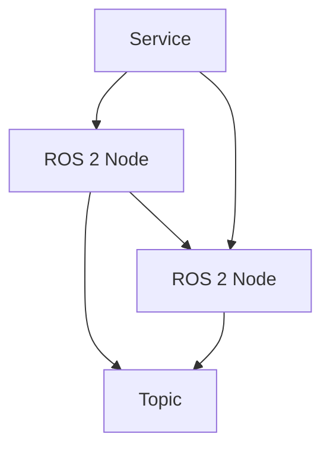

# Research: Textbook Content Structure Implementation

## Decision: Docusaurus Structure for Textbook

**Rationale**: Docusaurus is an ideal choice for creating educational content like textbooks because it provides built-in features for documentation sites, including sidebar navigation, category organization, and support for MDX (Markdown with React components). The structure allows for clear organization of modules and chapters as required by the specification.

**Alternatives considered**:
- GitBook: More limited customization options
- Hugo: Requires more complex configuration for this use case
- Custom React app: Would require building navigation and organization from scratch

## Decision: MDX Content Structure with Required Elements

**Rationale**: MDX format allows for embedding React components within Markdown, which is perfect for including interactive elements, code blocks, diagrams, and the required personalization buttons. Each chapter can include all required elements (hero section, learning objectives, code blocks, diagrams, simulation sections) in a single file.

**Alternatives considered**:
- Pure Markdown: Would not support interactive elements
- HTML: Would be more verbose and harder to maintain

## Decision: Sidebar Configuration Approach

**Rationale**: Docusaurus sidebars are configured through the `sidebars.js` or `sidebars.ts` file, which allows for hierarchical organization of content. The categories (Foundations, ROS2, Simulation, NVIDIA Isaac, Humanoids, VLA, Hardware, Capstone) can be organized as separate sections with corresponding modules nested under them.

**Implementation**: The sidebar configuration will map to the folder structure in `book_frontend/docs/` with `_category_.json` files to define the category titles and navigation.

## Decision: Mermaid.js Implementation for ROS 2 Architecture Diagrams

**Rationale**: Mermaid.js is natively supported in Docusaurus and allows for creating clear, text-based diagrams that can represent ROS 2 node architectures effectively. It's lightweight and renders directly in the browser.

**Example syntax**:


## Decision: Docusaurus Admonitions for Hardware Requirements

**Rationale**: Docusaurus provides built-in admonition components (:::tip, :::danger, :::info, :::caution) that are perfect for highlighting hardware requirements. These provide visual distinction and follow accessibility standards.

**Implementation**:
```markdown
:::tip
Recommended workstation: NVIDIA RTX 4070 Ti (12GB VRAM) or higher
:::

:::danger
Critical requirement: Minimum 64GB RAM DDR5 for complex scene rendering
:::
```

## Decision: Personalization Feature Implementation

**Rationale**: The personalization feature ("Personalize for Me", "اردو میں ترجمہ کریں") can be implemented using React components in the MDX files. These would interact with user authentication to provide customized content based on user profile information.

**Implementation approach**: Create reusable React components that can be included at the top of each chapter MDX file, which will handle the personalization and translation functionality.

## Decision: Content Word Count Management

**Rationale**: To maintain educational quality while adhering to the 500-1000 word constraint, content will be organized with clear sections, focused explanations, and practical examples rather than verbose descriptions. This ensures comprehensive coverage without unnecessary repetition.

**Approach**: Structure each chapter with specific sections (Learning Objectives, Theory, Code Examples, Practical Applications, Summary) to ensure consistent coverage and length control.